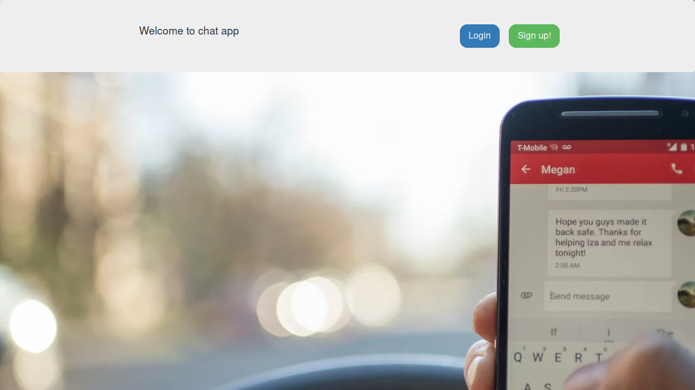

# chat-room

### not using the default normal approch of making the ajax call continuously and refreshing the page content. 

#### instead we will use websockets/django_channels for real-time communications and redis-server as backend.

